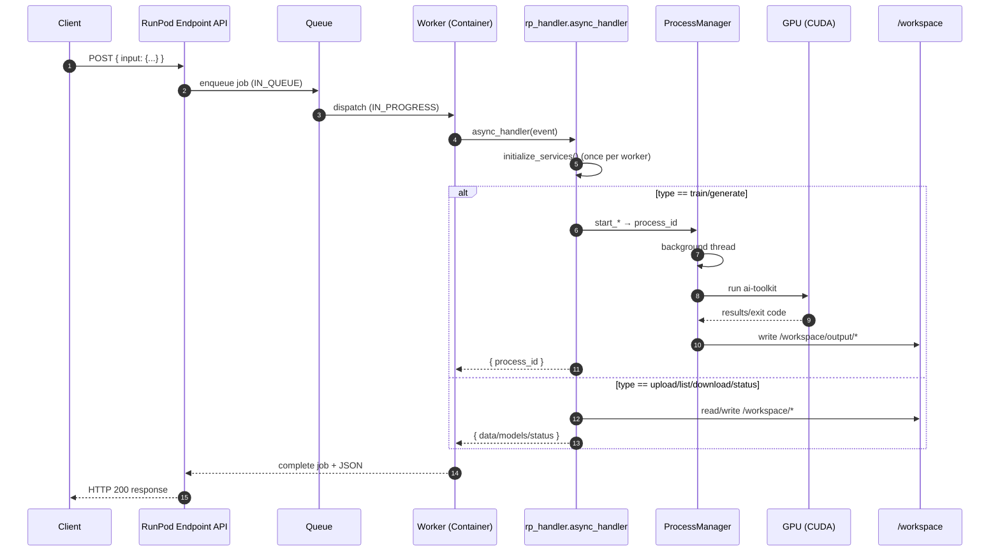

## RunPod Serverless — Pełny przepływ backendu (End‑to‑End)

Opracowanie opisuje, jak w tym repo działa przepływ na RunPod Serverless: od przyjęcia żądania, przez kolejkę, wykonanie na GPU, aż po zapis wyników i ich pobieranie. Dotyczy to głównie `Backend/rp_handler.py` i integruje kluczowe elementy z `Dockerfile`, `startup.sh` oraz logiką „procesów” i plików w `/workspace`.

### Najważniejsze w skrócie
- **Kolejka RunPod**: wykorzystywana jest wbudowana kolejka RunPod (stany: IN_QUEUE → IN_PROGRESS → COMPLETED). Nie ma dodatkowego Redisa — statusy jobów utrzymuje RunPod, a nasz kod tylko zwraca wynik lub identyfikator procesu (to założenie projektu). 
- **Wejście/wyjście**: handler przyjmuje `JSON` pod kluczem `input`, rozpoznaje `type` i zwraca `JSON`. Dane i artefakty, które przekraczają limity payload, należy zapisywać poza odpowiedzią (np. na dysku lub w S3) i zwracać referencję lub dane w porcjach.
- **GPU i trening**: ciężkie operacje (np. trening LoRA) uruchamiane są w wątku w tle w tym samym kontenerze, z użyciem `ai-toolkit`. Wyniki lądują w `/workspace/output`.
- **Pliki**: dane treningowe i artefakty są zapisywane w `/workspace/...` workera. To przestrzeń efemeryczna per worker; dla trwałości między workerami zalecany jest obiektowy storage (np. S3).

### Architektura i start workera
- Obraz bazowy (GPU) startuje `python -u /rp_handler.py` (zob. `Backend/Dockerfile`, `Backend/startup.sh`).
- Przy pierwszym wywołaniu handlera wykonywana jest inicjalizacja środowiska:
  - tworzone są katalogi: `/workspace`, `/workspace/training_data`, `/workspace/models`, `/workspace/output`, `/workspace/logs`,
  - opcjonalna instalacja/aktualizacja zależności (np. `huggingface_hub[cli]`, wybrane biblioteki ML),
  - klonowany jest `ai-toolkit` do `/workspace/ai-toolkit` i instalowane jego wymagania,
  - weryfikowana jest dostępność GPU (`nvidia-smi`).

### Handler i routing typów zleceń
Główny punkt wejścia to `async_handler(event)` w `Backend/rp_handler.py`. Oczekiwany format wejścia:

```json
{
  "input": {
    "type": "train" | "train_with_yaml" | "generate" | "health" | "processes" | "process_status" | "lora" | "list_models" | "cancel" | "download" | "upload_training_data" | "bulk_download" | "list_files" | "download_file",
    "config": "opcjonalnie: YAML jako string",
    "yaml_config": "opcjonalnie: YAML jako string",
    "process_id": "opcjonalny identyfikator procesu"
  }
}
```

W zależności od `type` wywoływana jest odpowiednia ścieżka w handlerze (np. `handle_training`, `handle_generation`, `handle_upload_training_data`, `handle_download_file`, itd.). Przy braku `type` a obecnym `prompt` domyślnie traktujemy to jako `generate`.

### Przepływ end‑to‑end
1) Klient wysyła `POST` do endpointu RunPod z `{ "input": {...} }`.
2) RunPod dodaje job do własnej kolejki; po przypisaniu workerowi stan przechodzi do `IN_PROGRESS`.
3) Worker (kontener) przyjmuje job i woła `async_handler(event)`.
4) Jednorazowo (per worker) inicjalizowane są serwisy oraz środowisko (workspace, `ai-toolkit`, itp.).
5) Na podstawie `type` wykonywana jest odpowiednia operacja:
   - `upload_training_data`: pliki w base64 zapisywane są do `/workspace/training_data` (liczenie obrazów/opisów, walidacje, podsumowania),
   - `train`/`train_with_yaml`: powstaje `process_id`, tworzony jest plik YAML, uruchamiany jest trening `ai-toolkit` w tle na GPU; status procesu jest aktualizowany w pamięci workera,
   - `generate`: analogicznie jak trening (tu placeholder — do rozwinięcia pipeline SD),
   - `list_files`/`lora`/`download_file`/`download`: przegląd i pobranie plików z `/workspace` (pobranie jako base64),
   - `process_status`/`processes`/`cancel`: odczyt/zmiana statusów procesów utrzymywanych w pamięci RAM workera.
6) Handler zwraca odpowiedź (np. `{ "process_id": "..." }` albo dane/plik w base64). RunPod kończy job i odpowiada klientowi.

### Wykonanie na GPU i procesy w tle
- `RealProcessManager` uruchamia ciężkie zadania w wątku „background” (daemon) wewnątrz tego samego kontenera.
- Trening:
  - zapis YAML do `/workspace/training_*.yaml`,
  - zalogowanie do HuggingFace (token z env),
  - `python3 /workspace/ai-toolkit/run.py <config.yaml>` z ustawionym środowiskiem CUDA,
  - outputy w `/workspace/output` (np. LoRA `.safetensors`); status `completed`/`failed` aktualizowany w pamięci.

### Pliki i magazyn
- Upload: do `/workspace/training_data` (dla prostoty, bez subfolderów, o ile nie doprecyzowano inaczej w wejściu).
- Wyniki: `/workspace/output`, opcjonalnie podkatalogi na obrazy (`generated`) lub wyniki treningów.
- Pobieranie:
  - `download_file`: zwraca wskazany plik jako base64 (zabezpieczenie: ścieżka musi zaczynać się od `/workspace/`).
  - `download`: zwraca plik procesu (po `process_id`) jako base64, jeśli proces zakończony i wskazuje pojedynczy artefakt.
  - `list_files` i `lora`: skany katalogów w poszukiwaniu obrazów i modeli LoRA.

Uwaga operacyjna: ponieważ statusy procesów są w RAM bieżącego workera, kolejne zapytania dotyczące `process_status` lub `download` muszą trafić do tego samego workera, inaczej proces nie zostanie znaleziony. Dla niezależności od przypisania workera zalecane jest trwałe przechowywanie statusów/artefaktów (np. S3 + metadane w DB).

### Limity payload i tryby wywołań (RunPod)
- Operacje endpointów (`/run`, `/runsync`, `/status`, `/stream`, `/cancel`, `/health`) opisuje dokumentacja RunPod.
- Aktualne limity wg dokumentacji:
  - `/run` (asynchroniczne): do 10 MB payload,
  - `/runsync` (synchron.): do 20 MB payload,
  - wyniki utrzymywane: ~30 minut (async) i ~60 sekund (sync) po zakończeniu.
- Starsze wzmianki o limicie 2 MB dla input/output w handlerze nie dotyczą `/run` i `/runsync` w najnowszym opisie — stosuj limity 10/20 MB dla endpointów.

### Przykłady wywołań (input)
- Health:
```json
{ "input": { "type": "health" } }
```
- Start treningu z YAML:
```json
{ "input": { "type": "train_with_yaml", "yaml_config": "config: { process: [...] }" } }
```
- Status procesu:
```json
{ "input": { "type": "process_status", "process_id": "train_ab12cd34ef56" } }
```
- Upload pliku (base64):
```json
{ "input": { "type": "upload_training_data", "training_name": "matt", "files": [ { "filename": "IMG_1.jpg", "content": "<base64>", "content_type": "image/jpeg" } ] } }
```
- Pobranie pliku po ścieżce:
```json
{ "input": { "type": "download_file", "file_path": "/workspace/output/model.safetensors" } }
```

### Schemat sekwencji (Mermaid)



### Ograniczenia i rekomendacje
- Statusy procesów w RAM per worker → dla niezawodności rozważ przeniesienie metadanych do trwałego magazynu (np. S3 + DB/kv).
- `/workspace` jest efemeryczne względem cyklu życia workera; dla długoterminowej trwałości używaj S3.
- Nie loguj sekretów (np. `HF_TOKEN`); przekazuj je przez zmienne środowiskowe.
- Ujednolić docelowe ścieżki wyników (np. jeden spójny katalog w `/workspace/output`) i ewentualnie dodać archiwizację wyników do S3.

### Odnośniki do dokumentacji
- Handlery — przegląd i przykłady: [docs.runpod.io/serverless/workers/handlers/overview](https://docs.runpod.io/serverless/workers/handlers/overview)
- Endpointy — operacje i limity: [docs.runpod.io/serverless/references/operations](https://docs.runpod.io/serverless/references/operations)
- Serverless — ogólny opis i zastosowania: [docs.runpod.io/serverless/overview](https://docs.runpod.io/serverless/overview)

### Gdzie w repo
- Główny handler: `Backend/rp_handler.py`
- Konfiguracja obrazu: `Backend/Dockerfile`
- Start środowiska: `Backend/startup.sh`
- Przykładowe minimalne handlery: `SimpleBackend/handler.py`, `FastBackend/handler_fast.py`


